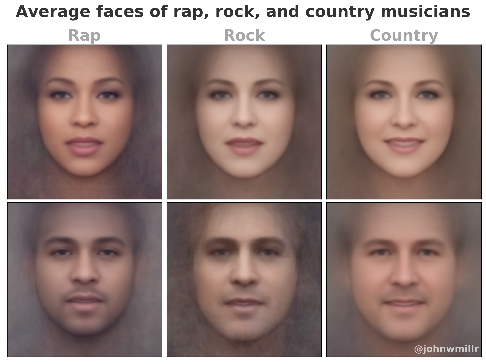

# Music genre average faces

I've been playing with face averaging and was curious what the average faces of rap, rock, and country music looked like.

**Source**:

  - Here's my [source code](https://github.com/johnwmillr/average-artist-faces) for the project.
  - I scraped musician pictures using Google image search.

**Tools**:

  - [Facer](https://github.com/johnwmillr/Facer)
  - Python and Matplotlib

I downloaded images of musicians from each genre and used my [Facer](https://github.com/johnwmillr/Facer) Python package to blend the faces together. Check out this [Jupyter notebook](https://github.com/johnwmillr/average-artist-faces/blob/master/downloadArtistImages.ipynb) if you're interested in which musicians were combined for each genre. I tried to combine at least 100 artists for each genre and gender. Gender was based on an artist's name coming from "Top *Female* Country Artists" lists, etc.

